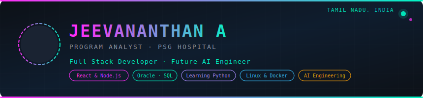

  

  
  
  
  

  

### 🧑‍💻 About Me

B.E. Computer Science & Engineering graduate from **Bannari Amman Institute of Technology**, Erode (CGPA: 7.48), with a minor in Sensor Technologies & IoT. I build responsive, impactful web applications and have hands-on exposure to cloud enterprise platforms.

- 🏥 **Program Analyst** @ PSG Hospital, Coimbatore — building healthcare web apps
- ☁️ **Associate Cloud Consultant Intern** @ Cloudvice, Kochi — Oracle Cloud ecosystem
- 🤖 Exploring **AI Engineering**, **Python**, **Linux**, and **Docker**
- 📍 Punjai Puliampatti, Tamil Nadu | 📞 6380303160

---

### 🛠️ Tech Stack

**Languages**

**Frontend**

**Backend & Database**

**Cloud (Oracle)**

**Tools**

---

### 💼 Experience

| Role | Organization | Duration |
|---|---|---|
| Program Analyst | PSG Hospital, Coimbatore | Aug 2025 – Present |
| Associate Cloud Consultant Intern | Cloudvice, Kochi | Mar – Jun 2025 |
| IoT & Android Developer Intern | AJ Tech, Coimbatore | Jan – Feb 2023 |
| Automation Intern | Chettinad Cement, Karur | Apr – May 2022 |

---

### 🚀 Projects

**🏥 Patient Reports Management & Cardiology Management System**
Redesigned the patient portal into a responsive web platform (TypeScript + Tailwind CSS) — patients can access prescriptions, lab reports, radiology reports, and admission details. Cardiology module converted to a web-based system for treatment tracking and dosage management.
`React.js` `Node.js` `Express.js` `MySQL` `TypeScript` `Tailwind CSS`

**🛏️ Room Allotment System**
Web-based room allocation system for PSG Hospital staff and patients, managing availability, bookings, and patient details through an internal portal.
`React.js` `Bootstrap` `Node.js` `Express.js` `MySQL`

**🩸 IoT, ML & Breath-Based Non-Invasive Blood Glucose Meter**
ML application using Linear Regression, Decision Tree, and SVM to detect glucose levels from breath data. Trained, tuned, and optimized model accuracy. *(Team of 4)*

**🔐 Alternate OTP Authentication for Weak Signal Areas**
Led a team of 6 to build a website enabling offline OTP generation via QR scanning — solving authentication in low-connectivity zones.
`HTML` `CSS` `MySQL`

---

### 📊 GitHub Stats

  
  

  

---

### 🌐 Languages &nbsp;|&nbsp; 🎤 Activities

🗣️ Tamil • English • Kannada (spoken)

- **English Moderator (ELCC)** — BIT Communication Department
- **Event Co-ordinator (LUNARA'24)** — BIT CSE Department Workshop, 2024

---

  <a href="https://jeeva27dips.vercel.app/"><b>🌐 Portfolio</b></a> •
  <a href="https://www.linkedin.com/in/jeevananthan-a-420848266"><b>💼 LinkedIn</b></a> •
  <a href="mailto:jeevakowshick2127@gmail.com"><b>📧 Email</b></a>

<i>Let's build something great together 🚀</i>

